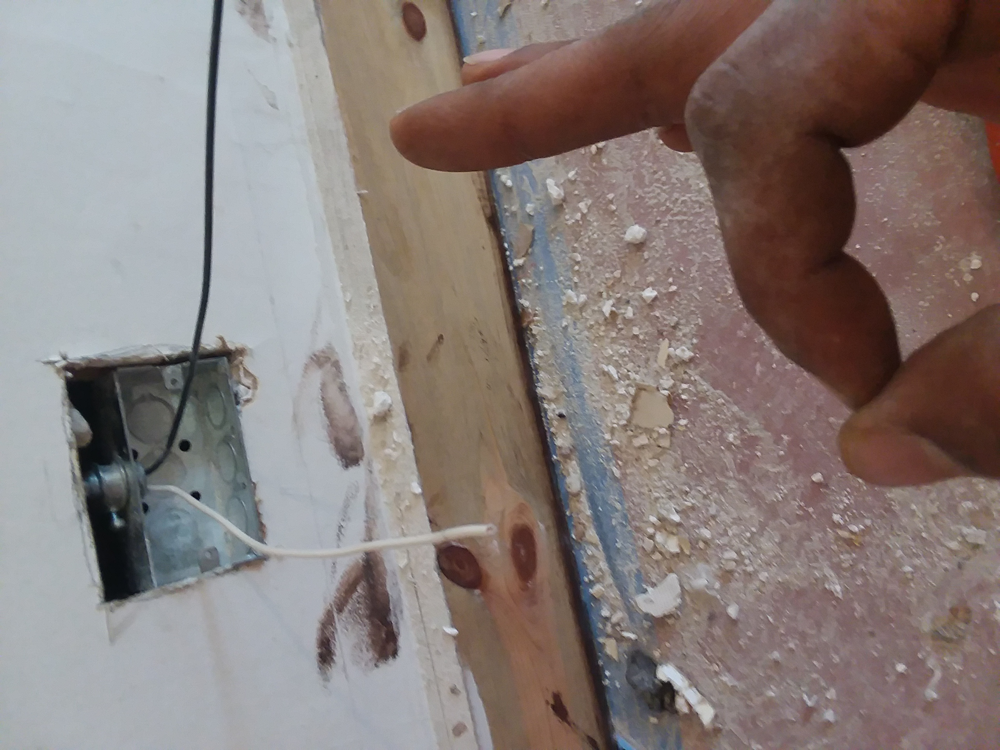
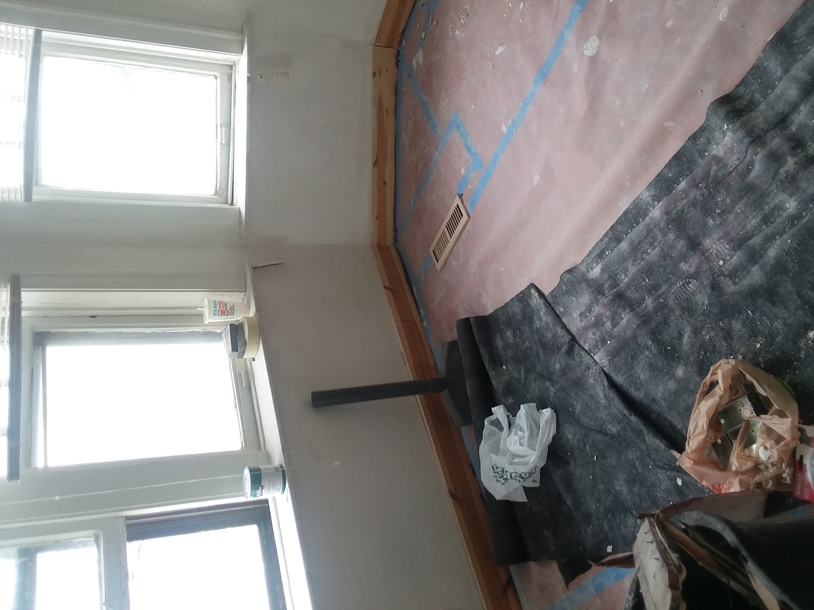

# Ramzee Christiel

## Where are you from?

I'm from the the south side of Chicago, approximately 8 mile from here in the Chatham neighborhood.

## IT Interest

My background is in IT starts at IIT and has grew to more than just a career choice. I feel empowered through the educational experience and have developed a passion for security, learning more and teaching.

## Something Interesting About You

I can do almost everthing construction. I recently inherited a 6 unit apartment building that was given to me in a distressed state, There is so much work that I've put in and a lot left.One project I've had to install new gas pipes extending from each unit into the utilty room leading outside to the meters. Fall semester(In Chicago's winter 2017) ...cold cold cold

## Git-IT Tutorial Badge

